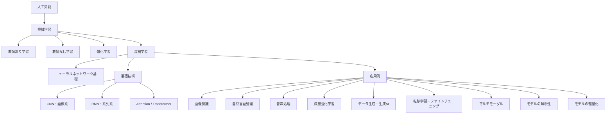
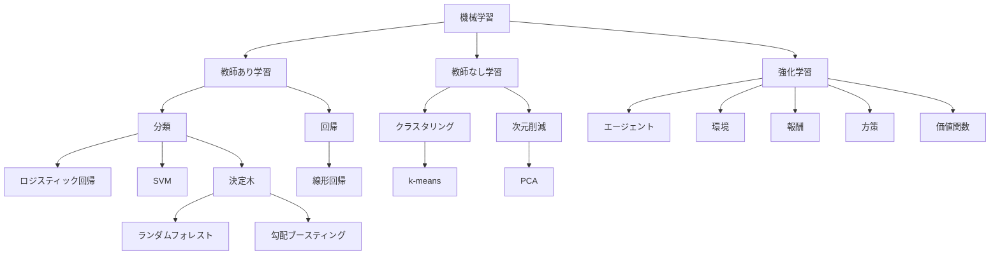
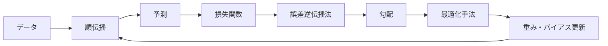
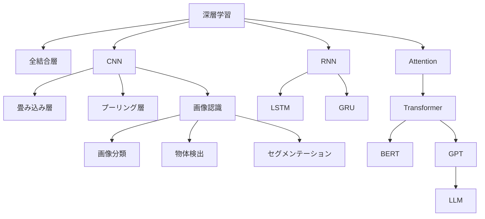
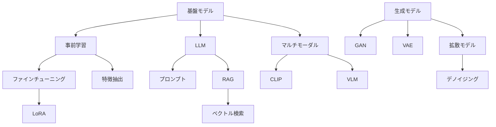
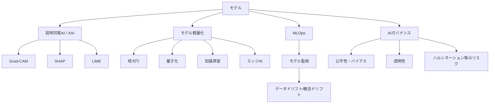

# G検定 用語関連マップ（機械学習・深層学習・応用中心）

作成日: 2026-06-30

この資料は、JDLA公式のG検定シラバス見出しに沿って、機械学習・深層学習・深層学習の応用で押さえるべき用語を、図解に使いやすい関係で整理したものです。実際の出題を保証するものではなく、学習・教材設計のための概念整理として使ってください。

公式参照:
- G検定公式ページ: https://www.jdla.org/certificate/general/
- シラバス掲載ページ: https://www.jdla.org/download-category/syllabus/

## 1. 全体像

## 2. 機械学習の関係図

### 機械学習で特に押さえる用語

- 学習方式: 教師あり学習、教師なし学習、強化学習
- 教師あり: 分類、回帰、線形回帰、ロジスティック回帰、決定木、ランダムフォレスト、SVM、k-NN、ナイーブベイズ、アンサンブル学習
- 教師なし: クラスタリング、k-means、階層的クラスタリング、PCA、次元削減、異常検知、協調フィルタリング
- 強化学習: エージェント、環境、状態、行動、報酬、方策、価値関数、Q学習、MDP、探索と活用
- 評価: 汎化、過学習、訓練・検証・テストデータ、交差検証、混同行列、正解率、適合率、再現率、F値、ROC、AUC、MSE、RMSE、MAE

## 3. 深層学習の学習ループ

### 深層学習で特に押さえる用語

- 構造: ニューラルネットワーク、人工ニューロン、入力層、隠れ層、出力層、重み、バイアス、パラメータ
- 活性化関数: シグモイド、tanh、ReLU、Leaky ReLU、GELU、ソフトマックス
- 損失関数: MSE、交差エントロピー、二値交差エントロピー、KLダイバージェンス
- 学習: 順伝播、損失関数、勾配、誤差逆伝播法、連鎖律、エポック、バッチ、学習率
- 最適化: 勾配降下法、SGD、Momentum、AdaGrad、RMSProp、Adam、AdamW
- 汎化対策: 正則化、L1/L2、Dropout、早期終了、データ拡張
- 学習問題: 勾配消失、勾配爆発、勾配クリッピング

## 4. 要素技術と応用の接続

## 5. 生成AI・転移学習・マルチモーダル

## 6. 解釈性・軽量化・社会実装

## 7. 図解を作るときの基本方針

1. まず「包含関係」を固定する: AI → 機械学習 → 深層学習 → 応用。
2. 次に「学習方式」を並列に置く: 教師あり、教師なし、強化学習。
3. 深層学習は「学習ループ」と「層・アーキテクチャ」に分ける。
4. 応用は「画像・言語・音声・生成・マルチモーダル・解釈性・軽量化」に分ける。
5. 生成AIは「モデル種別」と「利用・適応方法」を分ける。例: GAN/VAE/拡散モデルと、LLM/RAG/プロンプト/ファインチューニングは同じ図に混ぜすぎない。

## 8. 教材化の推奨構成

| 回 | テーマ | 図解の主題 | 中核用語 |
|---:|---|---|---|
| 1 | 全体像 | AI→ML→DL→応用 | 機械学習, 深層学習, 表現学習 |
| 2 | ML基礎 | 学習方式の分岐 | 教師あり, 教師なし, 強化学習 |
| 3 | 評価 | 汎化と評価指標 | 過学習, 混同行列, F値, MSE |
| 4 | DL学習 | 順伝播→逆伝播→最適化 | 損失関数, 勾配, Adam |
| 5 | CNN | 層と画像タスク | 畳み込み, プーリング, 物体検出 |
| 6 | 系列・Attention | RNN→Transformer | LSTM, Attention, Q/K/V |
| 7 | 生成AI | 生成モデルとLLM | GAN, VAE, 拡散モデル, LLM, RAG |
| 8 | 応用横断 | 転移・マルチモーダル・軽量化 | ファインチューニング, CLIP, XAI, 量子化 |
